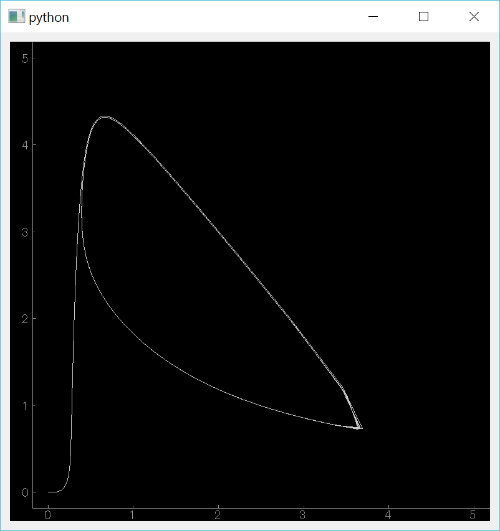

DrawBrusselator
===============

ブラッセレータ(Brusselator)の方程式を差分で計算し位相図を描くプログラム．
リアルタイム処理における負荷を下げるためあえて数値積分を用いずに漸化式で計算しています．
ブラッセレータについては文献[(1)]を参考にしました．なお続きものとして同名の記事[(2)]がありますのでタイトルで検索する場合には注意が必要ですｗ．
プログラムの構造は文献[(3)]の例を参考にしました．

Reference
----------
* [(1)] 郡宏,「振動と同期の数学的思考法I」,時間生物学, Vol.18 ,No.1,(2012)
* [(2)] 郡宏,「振動と同期の数学的思考法I」,時間生物学, Vol.18 ,No.2,(2012)
* [(3)] yukara_13,「【Python】 ぬるぬる動くスペクトルアナライザを作ろう！！」

[(1)]:http://chronobiology.jp/journal/JSC2012-1-022.pdf
[(2)]:http://chronobiology.jp/journal/JSC2012-2-080.pdf
[(3)]: http://yukara-13.hatenablog.com/entry/2013/12/05/025655